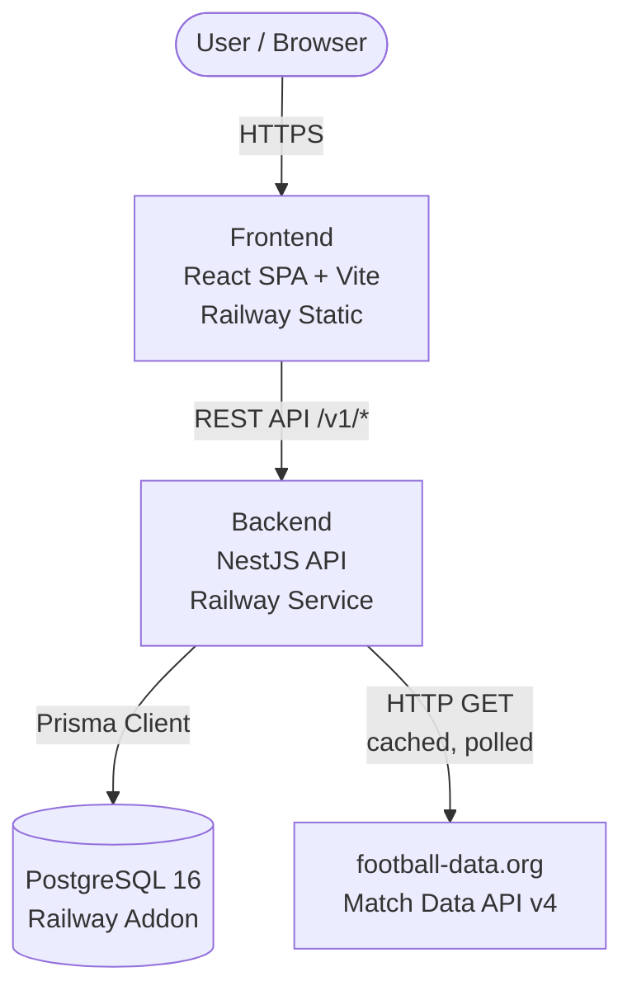

# Architecture Overview — world-cup-bets

> One-page system sketch. See ADR-001 for the full stack rationale.

## System Diagram

## Components

| Component | Role | Deploy |
|---|---|---|
| **Frontend** | React 18 SPA. Handles group creation UI, bet placement, leaderboard display. Communicates with backend via REST. | Railway static site |
| **Backend** | NestJS 10 API server. Handles auth, business logic (bet validation, scoring), serves match data from cache. | Railway web service |
| **Database** | PostgreSQL 16. Stores users, groups, bets, cached match data, leaderboard state. | Railway managed Postgres |
| **External: football-data.org** | Provides FIFA World Cup 2026 fixtures, scores, and match status. Polled by backend on a schedule (e.g., every 5 min during match days). | Third-party SaaS (free tier) |

## Data Flow (happy path)

1. User opens the SPA → served from Railway static.
2. SPA authenticates (JWT) → backend validates.
3. User creates/joins a group → `POST /v1/groups` or `POST /v1/groups/:id/join`.
4. User places a bet on an upcoming match → `POST /v1/bets` (validated: match not started, user in group).
5. Backend cron job polls football-data.org → updates match results in DB.
6. Scoring job runs after match completion → computes points per bet.
7. User checks leaderboard → `GET /v1/groups/:id/leaderboard`.

## Key Architectural Decisions

- **ADR-001**: Stack choice (NestJS + PostgreSQL + React + Railway)
- Match data cached server-side to respect rate limits (10 req/min free tier).
- Auth via JWT (details in future ADR).
- All timestamps UTC / RFC-3339.

## Risks

| ID | Risk | Mitigation |
|---|---|---|
| R-1 | Onboarding friction — friends won't sign up if it's heavy | Lightweight auth (magic link or social OAuth) — future ADR |
| R-2 | Match data source unreliable | football-data.org is proven (since 2015); fallback: manual entry by group admin if API fails |
